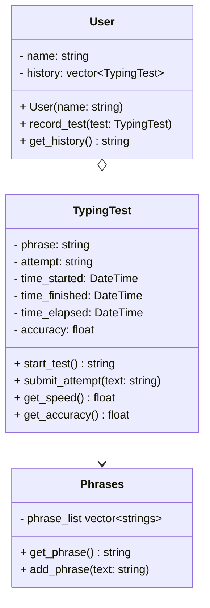

# tippitytappity

tippitytappity is a program to practice typing

## Data model

```mermaid
classDiagram
  %% comment
  TypingTest ..> Phrases
  User o-- TypingTest
  class TypingTest{
        - phrase: string
        - attempt: string
        - time_started: DateTime
        - time_finished: DateTime
        - time_elapsed: DateTime
        - accuracy: float
        + start_test() string
        + submit_attempt(text: string)
        + get_speed() float
        + get_accuracy() float
  }
  class Phrases{
        - phrase_list vector~strings~
        + get_phrase() string
        + add_phrase(text: string)
  }
  class User{
        - name: string
        - history: vector~TypingTest~
        + User(name: string)
        + record_test(test: TypingTest)
        + get_history() string
  }
```
